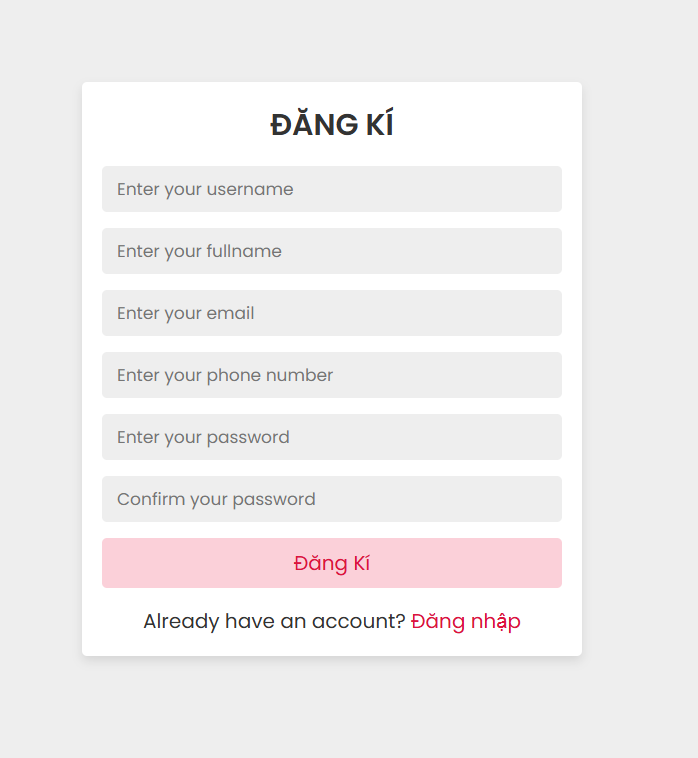
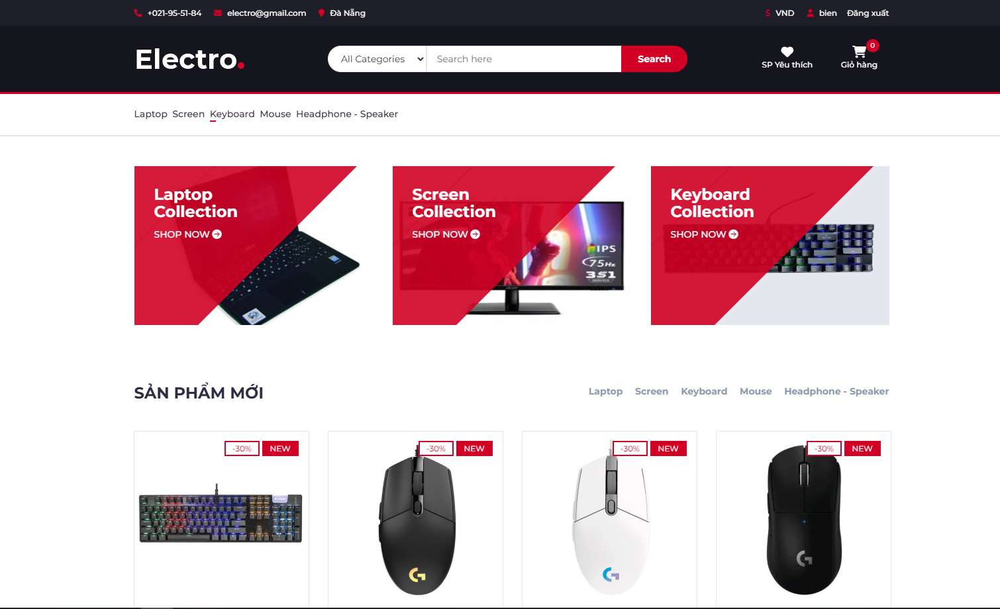

# ElectroPC Ecommerce Project

### Environment Requirements
- PHP 8.1.25 (cli) 
- XAMPP
- MySQL Database

## Features
- User Management
  - User registration and login
  - Profile management
  - Admin and customer roles
- Product System
  - Product categories
  - Product search functionality
  - Detailed product views with images
  - Product ratings and reviews
  - Wishlist functionality
- Shopping Features
  - Shopping cart management
  - Order processing
  - Order history tracking
- Admin Dashboard
  - User management
  - Product management
  - Category management
  - Order management
  - Sales tracking
  - Comment moderation

## Screenshots
- User





- Admin


## Getting Started
1. Clone the repository
```bash
git clone https://github.com/biennc/Electro_PC.git
```

2. Environment Setup
- Install XAMPP
- Start Apache and MySQL services
- Make sure PHP 8.1.25 is installed

3. Database Configuration
- Create database 'product_management'
- Import database structure from SQL files
- Configure connection in connect.php

4. Project Setup
- Place project files in xampp/htdocs/
- Access via http://localhost/Electro_PC

## Project Structure
```
Electro_PC/
├── AdminPC/           # Admin dashboard files
├── partitals/        # Reusable components
├── assets/           # Static resources
│   ├── css/         # Stylesheets
│   ├── js/          # JavaScript files
│   └── image/       # Image files
├── img/             # Product images
└── database/        # Database files
```

## Video demo
https://youtu.be/g9ZRbP1Y2ss

## Author
GitHub: https://github.com/biennc/

## Support
1. Add a Star 🌟 to this Repository
2. Follow on LinkedIn/Github